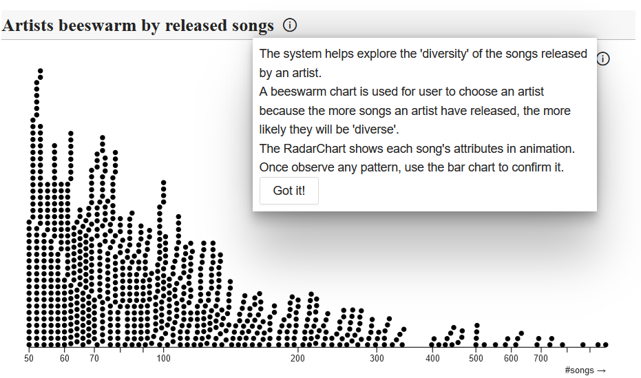
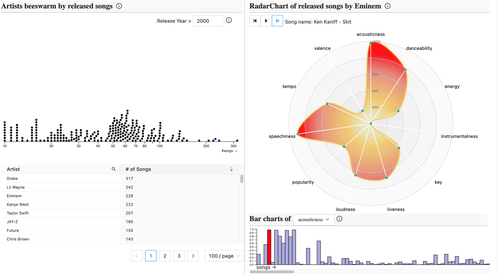
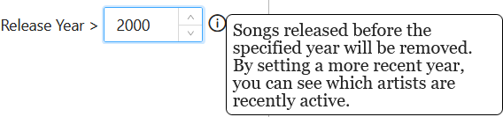
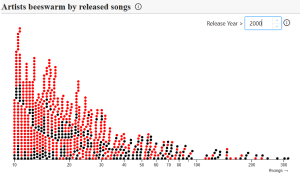
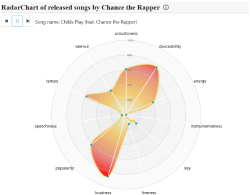

# Visualizing Artist Diversity
Goal of the system is to visualize `Artist Diversity` through visualizaions. 
An artist being 'diverse' means he/she covers the most artistic styles in the course of their career.
To demonstrate the use of the system, I used the [`Spotify-Data 1921-2020`](https://www.kaggle.com/datasets/ektanegi/spotifydata-19212020) that is public on Kaggle.
The dataset contains more than 16000 songs collected from Spotify Web API.
Each song has `artistic attributes` such as `liveness`, `tempo`, `dancebility`, `energy`, etc. 
The system uses these artistic attributes collectively to visualize the diversity of an artist.

Even though the dataset is particularly about singers, any other dataset with artistic attributes associated with each artwork is equally applicable to the system.
For example, a dataset on actors with artistic attributes such as genre or emotion for each film is also compatible.

## Visualization Design
</img>

The system starts out by presenting a modal with necessary information to introduce the system to users.
Once the user clicks `Got it!`, they can start their exploration freely.
Each visualization has an info icon explaining the goal and usage of the visualization.

A screenshot of the whole system:

</img>
The visualization design consists of two main parts: 
a `Beeswarm Chart` for overview of all singers and an `Animated Radar Chart` for detailed visualization of a singer's songs.
The bottom-right bar chart serves as a complementary view for the radar chart.

### Beeswarm Chart
The goal of the beeswarm chart is to provide an overview for user to choose an interested singer.
Each 'bee' on the chart represents a singer and the x-axis encodes number of songs they have released.
The assumption behind using this visualization and encoding is that the more songs a singer have released, the more likely they will be 'diverse'sed, the more likely they will be 'diverse'.

A threshold year can be set to filter out songs that are released after that year, as shown:
</img>
The effect of filtering out some older songs is that the whole beeswarm chart needs to be updated accordingly, because now the x-axis coordinates for the singers are different.
The update animation is shown in the video below:

### Animated Radar Chart
The radar chart arranges the songs of the selected singer in a sequence by year.
For each timestamp the radar chart shows the attributes of a song, and then animates into another.
The bar chart at the bottom shows the exact value of a selected attribute with current song highlighted.
A dropdown menu can be used to select other attributes.

The design behind the combination of an animated radar chart and a bar chart is that once any pattern is observed in the animation, user can go to the bar chart to confirm their findings.
A relatively static bar chart is needed as the pattern can be long-term and is gradually observed in animation, but in a static bar chart user can observe the same pattern at one glance.

A demo can be seen in the video below:

## Setup
### Dataset
To run the system, download the [`dataset`](https://www.kaggle.com/datasets/ektanegi/spotifydata-19212020) Kaggle and put the files under `src/preproces`. 
Then execute `preprocess.py`, which should generate `artist_song_dict.json`.
Move it under `src/assets/data` and the data is ready.

### Launch
To launch the system, execute `npm i` and then `npm run dev`. 
This should host the system on `localhost:5173` (port number may vary).
